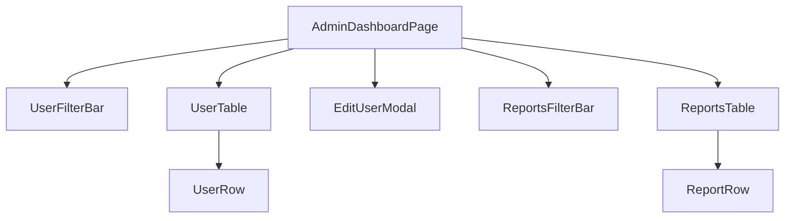

# Admin Dashboard — React Conversion (Person 5)

Converts the **Users panel** and **Moderation/Reports panel** of
`admin-dashboard.html` / `admin-dashboard.js` to React, per the FDFED
vanilla-JS → React migration.

## Component tree

```
AdminDashboardPage                 (owns all lifted state; talks to the backend)
├── UserFilterBar                  (role filter buttons + search input)
├── UserTable
│   └── UserRow × N                (one per user)
├── EditUserModal                  (conditionally rendered — Add AND Edit share this one component)
├── ReportsFilterBar               (status filter buttons)
└── ReportsTable
    └── ReportRow × N              (one per report)
```



## Props

| Component | Props |
|---|---|
| `UserFilterBar` | `activeFilter`, `searchQuery`, `onFilterChange(filter)`, `onSearchChange(query)` |
| `UserTable` | `users`, `onEdit(user)`, `onDelete(userId)` |
| `UserRow` | `user`, `onEdit(user)`, `onDelete(userId)` |
| `EditUserModal` | `user` (blank draft = Add mode, populated = Edit mode), `onSave(updatedUser)`, `onClose()` |
| `ReportsFilterBar` | `activeFilter`, `onFilterChange(filter)` |
| `ReportsTable` | `reports`, `onResolve(reportId)`, `onDelete(reportId)` |
| `ReportRow` | `report`, `onResolve(reportId)`, `onDelete(reportId)` |

## Lifted state (owned by `AdminDashboardPage`)

`users`, `currentUserFilter`, `userSearchQuery`, `editingUser` (drives the
modal — `null` = closed), `reports`, `currentReportFilter`. Lifted here
because the filter bar, table, and modal for each panel all read/write the
same underlying list.

## Callback flow

- **`UserRow` → `AdminDashboardPage`**: `onDelete(userId)` (wired to the
  page's `onDeleteUser` handler) — confirms, calls `DELETE /api/users/:id`,
  then removes the row from the shared `users` list on success.
- **`EditUserModal` → `AdminDashboardPage`**: `onSave(updatedUser)` — if
  `updatedUser.id` is set, `PATCH /api/users/:id`; if not, `POST /api/users`
  (create). Either way the shared `users` list is updated in place and the
  modal closes.
- **`ReportRow` → `AdminDashboardPage`**: `onResolve(reportId)` — the backend
  enforces sequential status transitions (`pending → reviewed → resolved`;
  `reviewed`/`escalated → resolved` directly), so this does a two-step PATCH
  when starting from `pending`, one PATCH otherwise. `onDelete(reportId)` —
  `DELETE /api/reports/:id`, removes the row on success.

## Shared utilities (`src/utils/`)

`api.js` (fetch wrapper matching the vanilla `window.API.users` /
`window.API.reports` surface, same `/api` backend, same `x-role` auth
header), `auth.js` (`getCurrentUser`, `getRole`, `getUserInitials` — reads
the same `nexus_user` localStorage key the rest of the app uses),
`useToast.js` (same toast UX/CSS as the vanilla pages).

## Bugs found and fixed during conversion

1. **Role filter was broken.** The original buttons filtered by
   `'active'/'banned'/'warned'`, none of which are real role values — always
   showed zero results. Fixed to filter by the real roles (`admin`,
   `moderator`, `community_manager`, `user`, `owner`).
2. **Report status filter mismatch.** The "In Review" button filtered by
   `'review'`, but the real status value is `'reviewed'` — always showed
   zero results. Fixed.
3. **`bio: ''` 400'd every create/save.** `CreateUserDto.bio` is
   `@IsOptional() @Length(5,160)` — `@IsOptional()` only skips `null`/
   `undefined`, not an empty string, so sending `bio: ''` tripped the
   min-length check. Fixed by omitting the field entirely when blank (same
   class-validator gotcha as an earlier `RegisterDto.lastName` fix
   elsewhere in this project).

## Verified live (Playwright + real backend, not just code review)

- Users load from `GET /api/users`; filtering by role and searching by
  username/email both narrow the table correctly.
- Edit a user in the modal → `PATCH /api/users/:id` → row updates in place,
  toast confirms.
- Create a user via the same modal (blank draft) → `POST /api/users` → new
  row appears.
- Delete a user → confirm dialog → `DELETE /api/users/:id` → row removed.
- Switch to the Moderation panel → reports load from `GET /api/reports`.
- Resolve a `pending` report → two-step PATCH (`reviewed` then `resolved`)
  → status badge updates, toast confirms.
- Delete a report → `DELETE /api/reports/:id` → row removed.
- Zero console/page errors across the whole flow.
- `npm run build` succeeds (production bundle: ~64KB gzipped JS+CSS).
